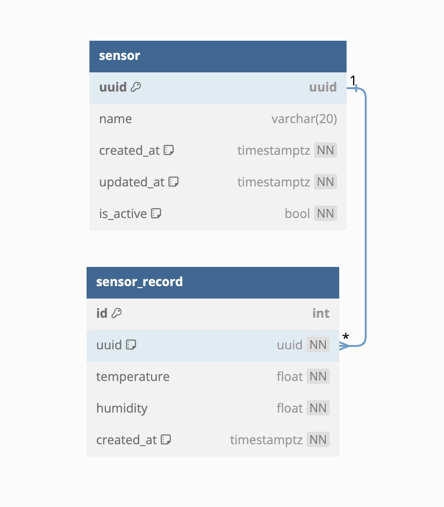

## 동기

- lightsail 을 위한 CI/CD를 AWS 통해 구축하고 싶다.
- AWS IAM에 관한 설정과 AWS CodeDeploy에 관한 설정을 알고 싶다.
- CD를 위한 배포 스크립트를 작성하고 싶다.
- AWS lightsail에서 websocket을 이용한 서비스를 구축하고 싶다.

## 개괄

### ERD

개괄적인 ERD

supabase와 gui를 이용해 따로 migration 관리를 하지 않았습니다.
